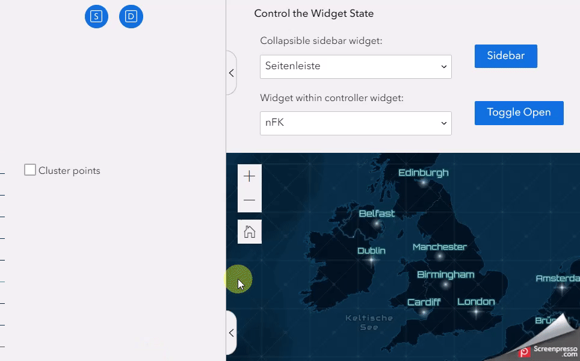

## Speedgeeking at European DevSummit Berlin 2023: 
# Four types of widget communication in ArcGIS Experience Builder

---
# WidgetManager
### Controlling the widget state

You can control the state of a widget on the UI by using the WidgetManager. 

In the official samples repo, you can find a sample showing this approach. It's called ['Control the widget state'](https://github.com/Esri/arcgis-experience-builder-sdk-resources/tree/master/widgets/control-the-widget-state). It identifies 
* sidebar widgets in your app and 
* widgets living inside a controller widget
and toggles if they appear expanded or collapsed.

### The crucial point

Use an ``appAction`` imported from the jimu framework to dispatch a ``openWidget`` or ``closeWidget`` action along with the widgetId via the global AppStore.

Like here: 
https://github.com/Esri/arcgis-experience-builder-sdk-resources/blob/master/widgets/control-the-widget-state/src/runtime/widget.tsx#L103

---
# DataSourceManager
### Sharing a data source

You can look at the same data source from several widgets throughout your app, but it takes some extra action to also share a selection programmatically applied on an map layer.

Here's a sample using this approach: ['Alternative select'](https://github.com/esride-nik/ExB-workshop/tree/master/widgets/alternativeSelect). It uses Sketch to draw a graphic on the map and a slider to define a buffer around it. As it is connected to a FeatureLayer datasource on a web map,
* is selects all features contained in the buffer and
* makes the selection available for other widgets looking at the same datasource.

### The crucial point

Use the ``DataSourceComponent`` to catch the FeatureLayer datasource in the widget code. Then query the FeatureLayerView for the ObjectIDs of the widgets within the buffer and pushes them into the DataSourceManager via ``featureLayerDatSource.selectRecordsByIds()``.

Like here:
https://github.com/esride-nik/ExB-workshop/blob/master/widgets/alternativeSelect/src/runtime/widget.tsx#L79